# Care Compass Hospitals

A comprehensive web application for hospital management, designed to streamline patient care, administrative tasks, and staff operations. This system includes a patient portal for appointments, medical records, and payments, alongside dedicated dashboards for admins and staff to manage users, records, and feedback.

This project was developed for educational purposes as part of a Web Application Development demonstration.

## Table of Contents

- [Features](#features)
- [Technologies Used](#technologies-used)
- [Installation](#installation)
- [Usage](#usage)
- [Screenshots](#screenshots)
- [License](#license)

## Features

- **Patient Portal**: Allows patients to register, log in, schedule appointments, view medical records, lab results, and make online payments.
- **Admin Dashboard**: Comprehensive management tools for admins to handle users (admin/staff/patients), appointments, medical records, lab results, doctors/staff profiles, feedback/queries, and payments.
- **Staff Dashboard**: Restricted access for staff to manage patients, appointments, records, results, profiles, feedback, and payments.
- **Doctors & Staff Profiles**: Display and manage profiles with details like specialties, qualifications, and availability.
- **Feedback & Queries**: Submission and management of user feedback or inquiries.
- **Online Payments**: Secure handling of payments with invoice tracking.
- **Secure Authentication**: User registration, login, and session management with password hashing.
- **Database Integration**: MySQL backend for storing user data, appointments, records, and more.
- **Responsive Design**: Mobile-friendly interfaces using CSS media queries.

## Technologies Used

- **Frontend**: HTML, CSS, JavaScript (ES6+)
- **Backend**: PHP (with MySQLi for database interactions)
- **Database**: MySQL
- **Security**: Password hashing with BCRYPT, input validation, and prepared statements to prevent SQL injection.
- **Tools**: Local server (e.g., XAMPP/WAMP), Git for version control.

No external frameworks or libraries are used (As per the assignment requirements).

## Installation

### Prerequisites
- PHP 7+ installed
- MySQL database server (e.g., via XAMPP, MAMP, or WAMP)
- Web browser (Chrome, Firefox, etc.)
- Git (optional, for cloning the repository)

### Steps
1. **Clone the Repository**:
   ```
   git clone https://github.com/sanjanaabeykoon7/care-compass-hospitals.git
   cd care-compass-hospitals
   ```

2. **Set Up the Database**:
   - Create a new MySQL database named `care_compass`.
   - Import the schema (create tables manually based on backend routes or use the provided SQL dump if available). Key tables include:
     - `users` (patients): id, full_name, email, password
     - `admin_staff`: id, full_name, email, password, role
     - `appointments`: id, patient_id, doctor, date, time
     - `medical_records`: id, patient_id, notes, prescriptions
     - `lab_results`: id, patient_id, test_name, test_date, result
     - `doctors_staff`: id, name, specialty, qualifications, contact, available_days, available_hours
     - `feedback_queries`: id, name, email, contact_number, department, message, submitted_at
     - `payments`: id, hospital, payment_category, invoice_no, patient_name, amount, payed_at
   - Update database credentials in `backend/config/db.php` if needed (default: localhost, root, no password).

3. **Start the Server**:
   - Use XAMPP/WAMP to start Apache and MySQL.
   - Place the project in the server's root directory (e.g., `htdocs` for XAMPP).

4. **Verify Setup**:
   - Access `http://localhost/care-compass-hospitals/frontend/home.html` in your browser.

## Usage

- **Patient Access**:
  - Navigate to `patient-portal.html` to log in or sign up.
  - Schedule appointments, view records, and manage payments via `portal-dashboard.html`.

- **Admin/Staff Access**:
  - Log in via `home.html` (profile icon - admin login route).
  - Admins use `admin-dashboard.html`; staff use `staff-dashboard.html`.
  - Manage all aspects through interactive tables and buttons.

- **API Endpoints**:
  - Backend routes handle CRUD operations (e.g., `/backend/routes/schedule_appointment.php` for POST requests).
  - Use tools like Postman for testing APIs.

- **Logout**:
  - Click the logout button on dashboards to destroy the session.

Ensure sessions are enabled in PHP for authentication.

## Screenshots

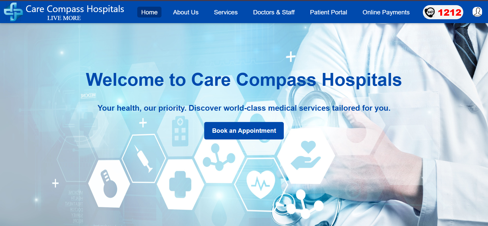
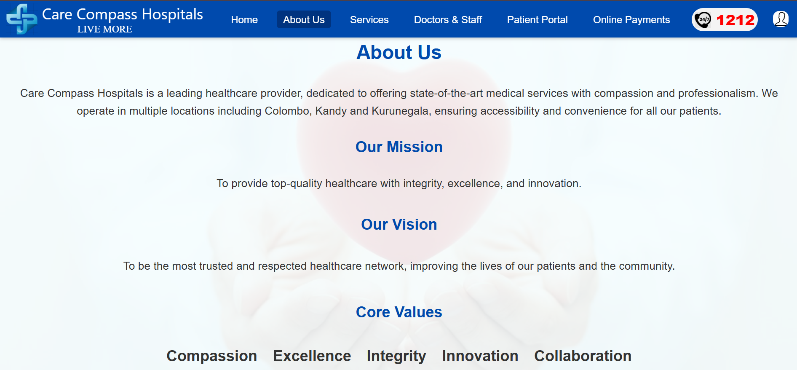
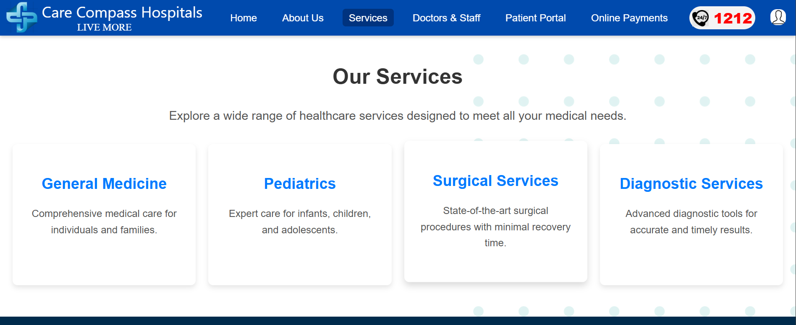
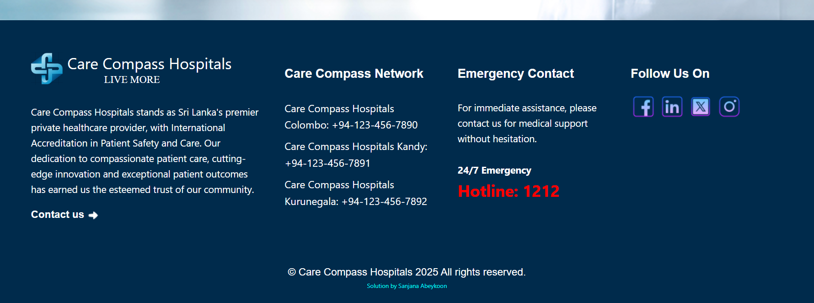
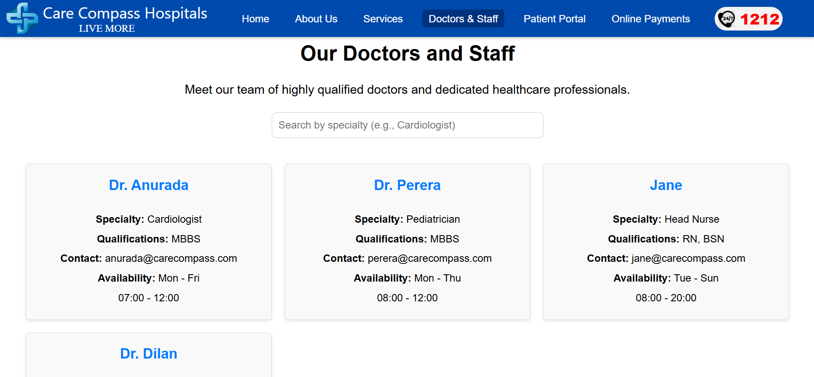
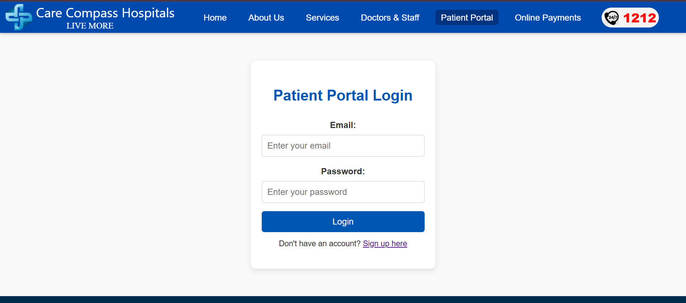
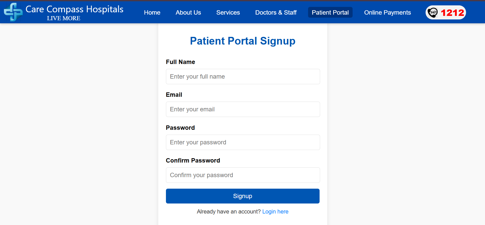
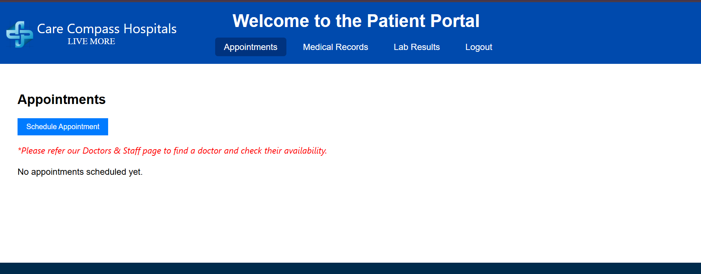
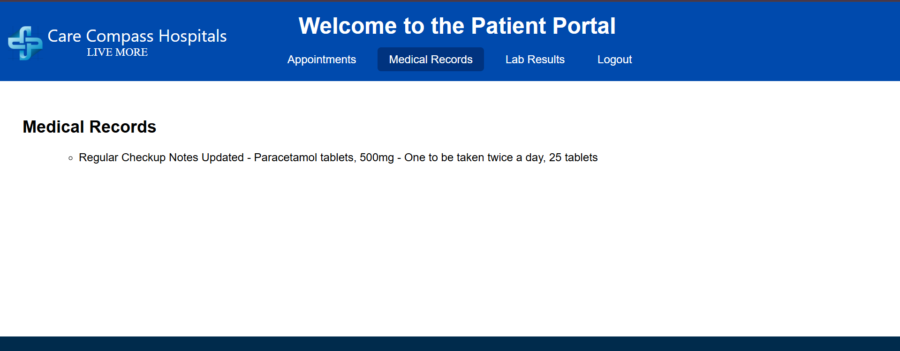
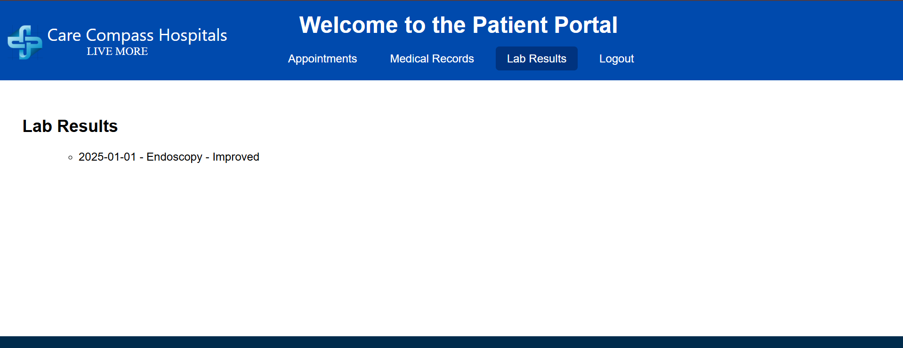
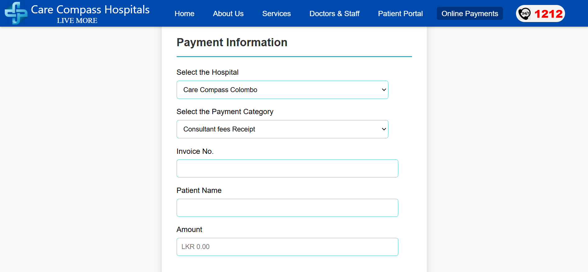
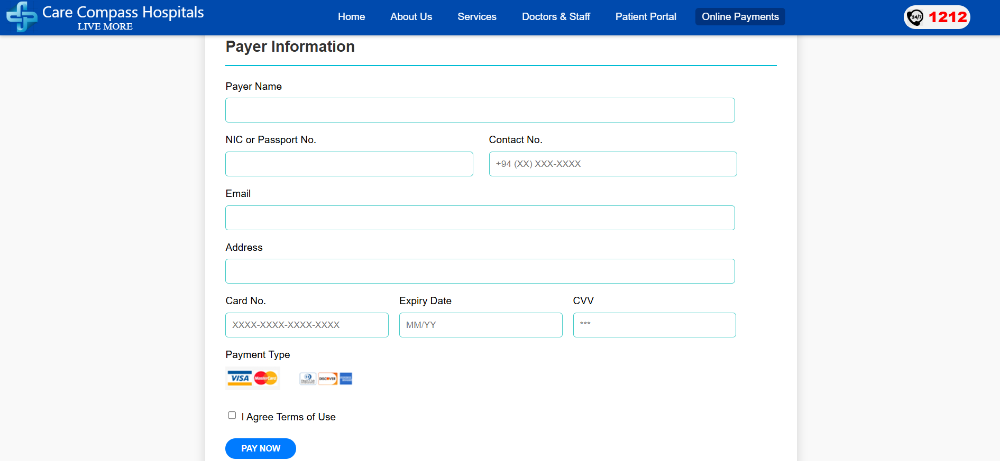
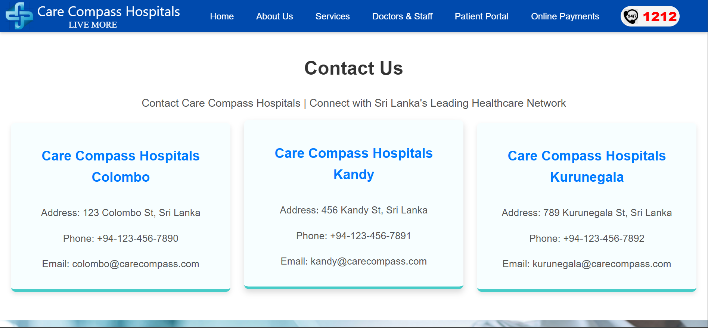
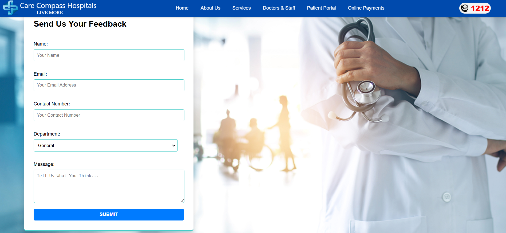
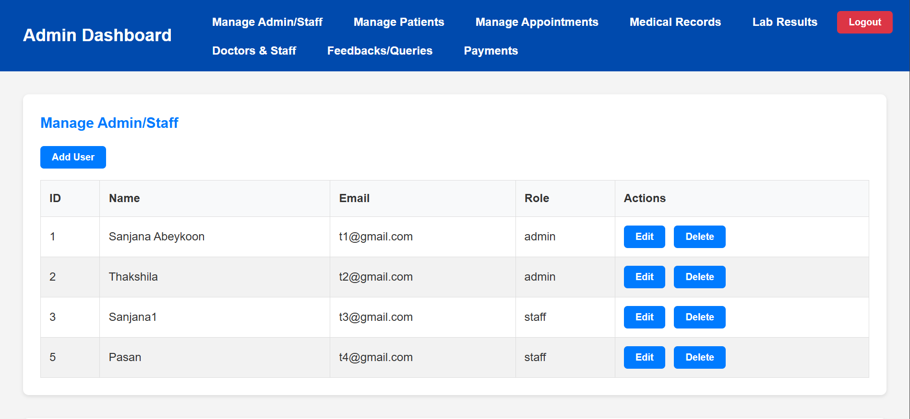
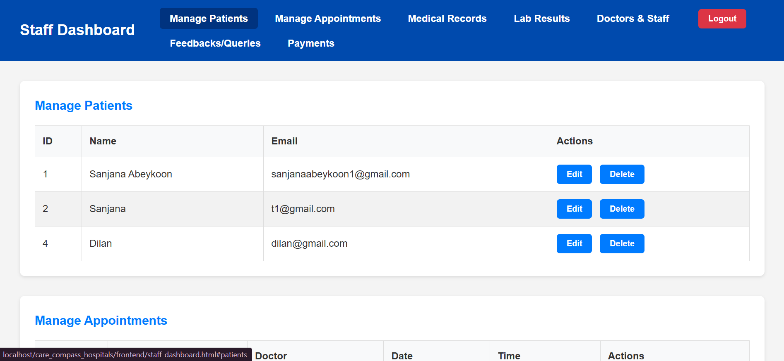
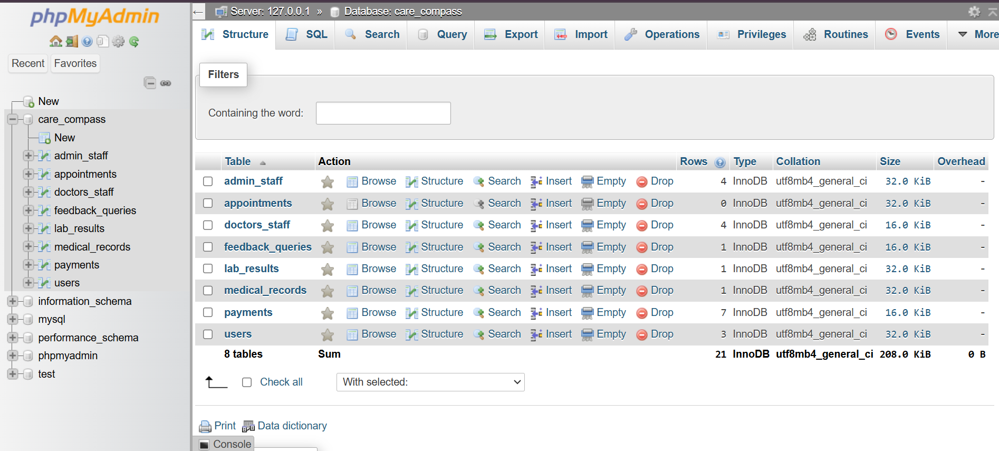

## License

This project is licensed under the MIT License - see the [LICENSE](LICENSE) file for details. Developed for educational purposes only.

---
